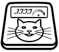
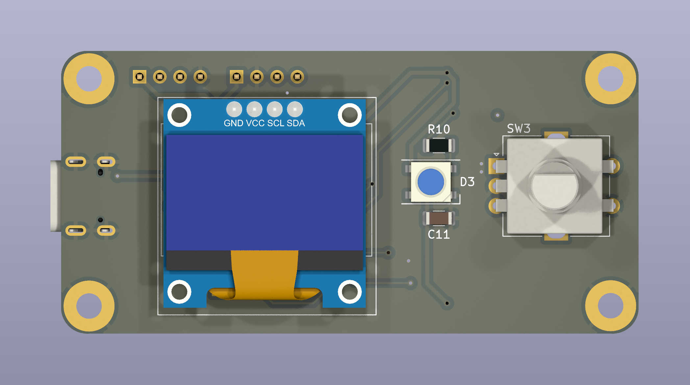
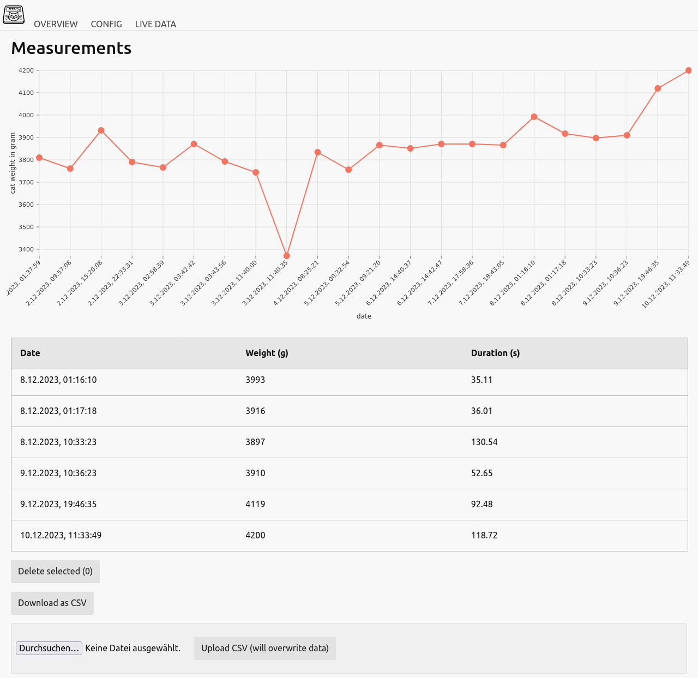

# weight-whiskers

This is an ESP32 S2 based smart scale that tracks my cat's weight and sends data via MQTT to my smart home. I did the project to automatically track my sick cat's weight when he visits his toilet. Unfortunately he died in August 2023. So this is dedicated to you, my beloved Schneeball 🖤🌈

Schneeball testing the scale

# Hardware

I made a prototype on a solder board with an ESP32 S2 breakout board. I like the WEMOS S2 mini which is very small. You might have to change some pins. Or just use the gerber files and make the PCB. You can find the KiCAD project and gerber files at [hardware](hardware/).

You can connect all load cells that are compatible with the HX711 IC. I'm using [four cells that can measure up to 50Kg](https://de.aliexpress.com/item/1005004867068245.html) because it's easier to keep a big cat toilet balanced.

 

## Schematic

[PDF](doc/pcb_schematic.pdf)

## 2D plot

#### Front

**Important:** Check the VCC and GND position of the display! Some displays have GND on the first pin and VCC on the second like in the rendered image. You need a display with `VCC  | GND | SCL | SDA` pinout as you can see in the 2D front plot.

#### Back

## 3D rendering

#### Front

#### Back

## Images

# Software

## Installation

Just install [PlatformIO](https://platformio.org/), clone the project, connect the device and run:
`pio run -t upload -e esp32s` to upload the sketch and `pio run -t uploadfs -e esp32s2` to upload the filesystem that contains the config file and web interface. Use the environment `-e esp32s2_ota` if you want to update the device via WiFi.
WARNING: When you update the filesystem you will overwrite the config file and measurements. So please backup it first!

# Usage

On first start the weight-whiskers scale will create an access point that has a config page at <http://192.168.4.1> where you can connect to your local WiFi. If the connection was successful you can find the actual web interface at <http://weight-whiskers.local> in your local network or check your internet router page to get the local IP address.

With a long press on the encoder you can calibrate the load cells with a known weight. The default weight is 500g but you can change it by rotating the encoder (or set it up on the web interface). Just follow the instructions on the display. To tare the scale just short press (<1s) the encoder button.

You can configure the `scale minimum weight` on the web interface. If the cat enters the scale, the LED lights up yellow and the scale measures the weight (with standard deviation) and duration until the cat left the scale. Afterwards the LED lights up green and the result will be stored in the CSV file and sent via MQTT message. If you connected the buzzer, a fancy sound will be played :D

## Web interface

On the web interface you can show, delete and down- and upload the data. The measurements are stored in a CSV file on the device. You can download it and open it in a text editor or import it with a spreadsheet editor. You can also edit the config and show the scale's live data.

 
  